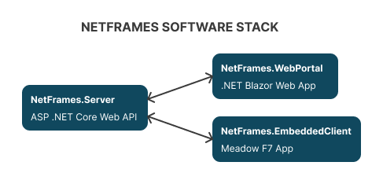
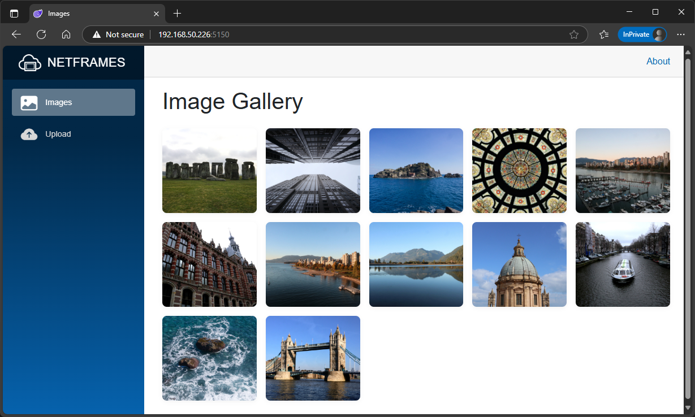
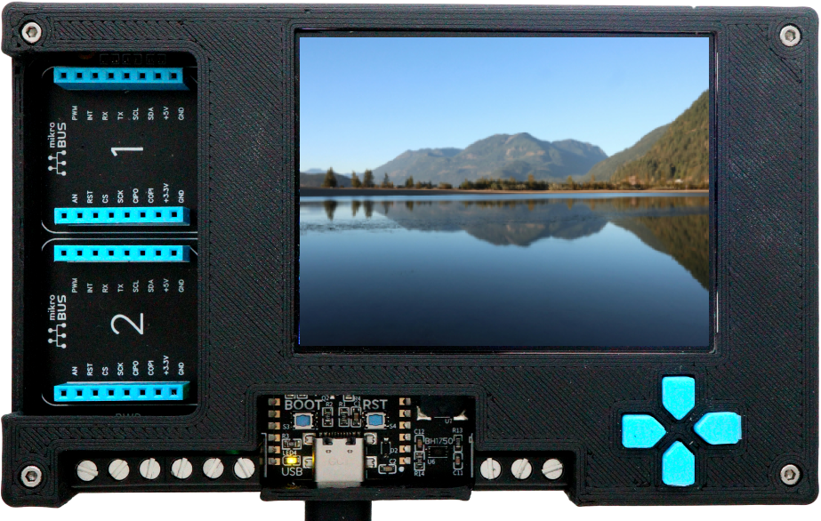

# NetFrames

NetFrames is a lightweight, connected display platform that allows digital picture frames or embedded screens to automatically fetch and display images from a central server. Designed for Raspberry Pi, Meadow, or mobile clients, NetFrames is ideal for personal photo galleries, public displays, or IoT art installations.

## Contents

* [Architecture](#architecture)
* [Build and Setup](#build-and-setup)
* [Support](#support)

## Architecture

### [NetFrames.Server](/Source/NetFrames.Server/)

NetFrames.Server is a .NET Core Web API, exposing endpoints to:
* Upload an image
* Get list of images
* Get specific image by ID.

### [NetFrames.WebPortal](/Source/NetFrames.WebPortal/)

The purpose of this portal is to manage the image collection that client devices will display on its screens.

### [NetFrames.EmbeddedClient](/Source/NetFrames.EmbeddedClient/)

Lorem ipsum dolor sit amet, consectetur adipiscing elit, sed do eiusmod tempor incididunt ut labore et dolore magna aliqua.

## Build and Setup

Lorem ipsum dolor sit amet, consectetur adipiscing elit, sed do eiusmod tempor incididunt ut labore et dolore magna aliqua.

## Roadmap

The following table show's whats available and what features are next in upcoming updates.

## Support

Finding bugs or wierd behaviors? File an [issue](https://github.com/jorgedevs/NetFrames/issues) with repro steps.
