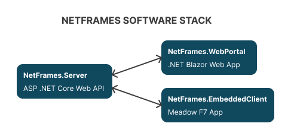
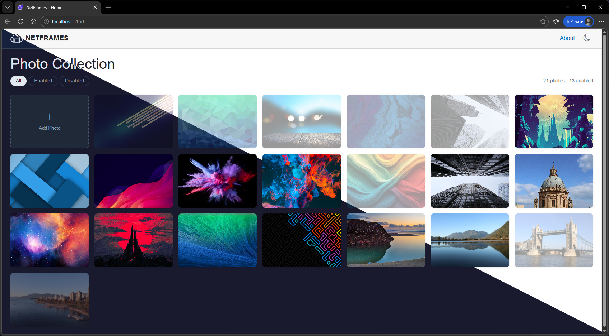
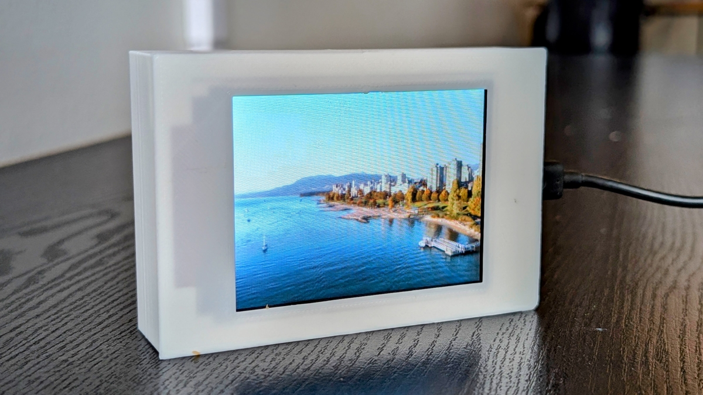
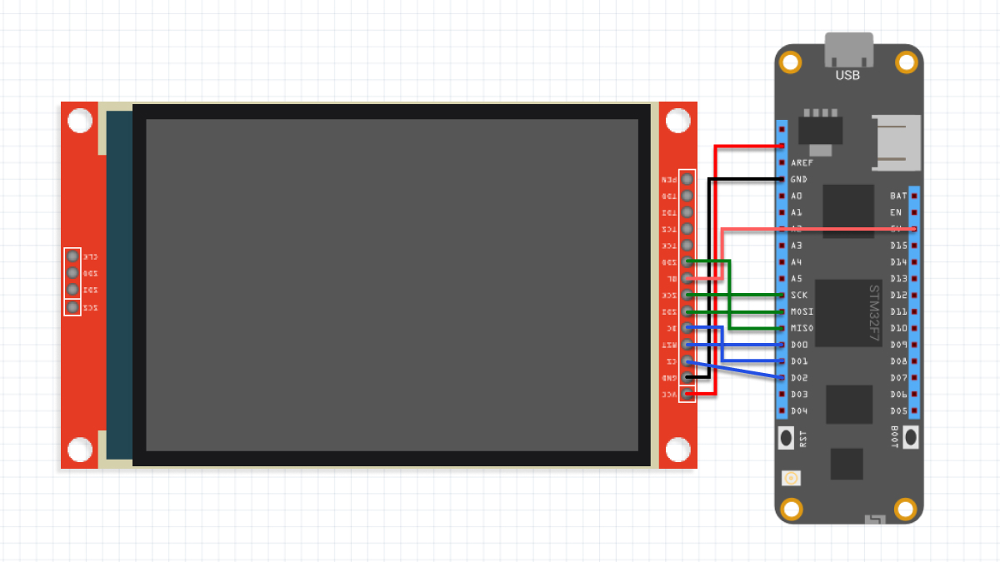
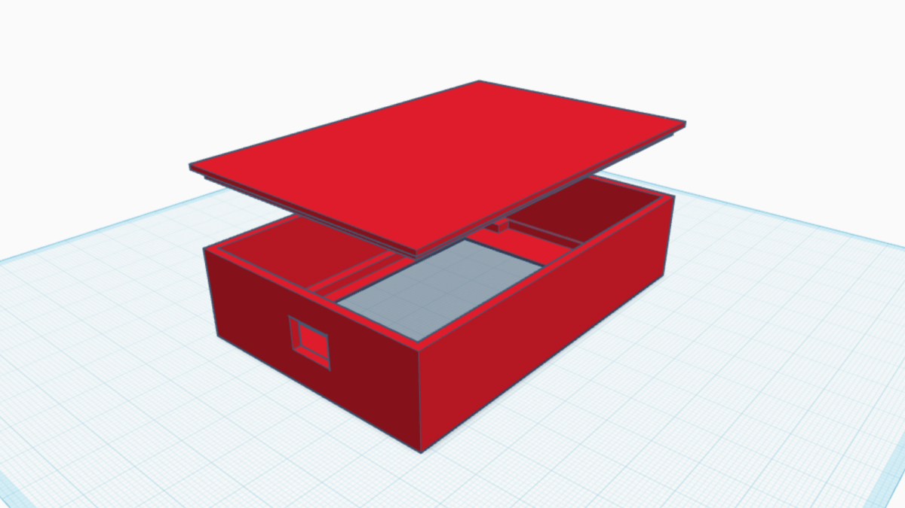

# NetFrames

NetFrames is a lightweight, connected display platform that allows digital picture frames or embedded screens to automatically fetch and display images from a central server. Designed for Raspberry Pi, Meadow, or mobile clients, NetFrames is ideal for personal photo galleries, public displays, or IoT art installations.

## Contents

* [Architecture](#architecture)
* [Build and Setup](#build-and-setup)
* [Support](#support)

## Architecture



### [NetFrames.Server](/Source/NetFrames.Server/)

NetFrames.Server is a .NET Core Web API, exposing endpoints to:
* Upload an image
* Get list of images
* Get specific image by ID.

### [NetFrames.WebPortal](/Source/NetFrames.WebPortal/)

The purpose of this portal is to manage the image collection that client devices will display on its screens.



### [NetFrames.EmbeddedClient](/Source/NetFrames.EmbeddedClient/)

You can build this digital portrait using a [Meadow F7 Feather](https://store.wildernesslabs.co/collections/frontpage/products/meadow-f7-feather) board and a ILI9341 TFT SPI 320x240 display.



#### Wiring

Wire the Meadow F7 Feather board with the ILI9341 like the diagram below:




#### Enclosure

Feel free to 3D print this enclosure so you can place it on a desk or mount it on a wall. STL files are [here](/Assets/Enclosure/) or download directly from [TinkerCad](https://www.tinkercad.com/things/222cHvoUr3W-netframes-case).




## Build and Setup

Both the Server and WebPortal target **.NET 10**. Make sure you have the [.NET 10 SDK](https://dotnet.microsoft.com/download/dotnet/10.0) installed.

### Configuration

The WebPortal connects to the Server's API via the `ApiBaseUrl` setting in `Source/NetFrames.WebPortal/appsettings.json`:

```json
{
  "ApiBaseUrl": "http://localhost:5233"
}
```

Update this value depending on where the Server is running (see scenarios below).

### Scenario 1: Running both locally (development)

When running both projects on the same machine, the default launch profiles handle the ports:

| Project | HTTP | HTTPS |
|---------|------|-------|
| NetFrames.Server | `http://localhost:5233` | `https://localhost:7044` |
| NetFrames.WebPortal | `http://localhost:5150` | `https://localhost:7118` |

These ports are configured in each project's `Properties/launchSettings.json`.

1. Start the Server:
   ```
   cd Source/NetFrames.Server
   dotnet run
   ```

2. In a separate terminal, start the WebPortal:
   ```
   cd Source/NetFrames.WebPortal
   dotnet run
   ```

3. Make sure `ApiBaseUrl` is set to `http://localhost:5233` in `appsettings.json` (the default).

4. Open `http://localhost:5150` in your browser.

### Scenario 2: Server on a remote machine (e.g. Raspberry Pi)

When running the Server on a separate machine (such as a Raspberry Pi), you need to configure the Server to listen on all network interfaces and point the WebPortal to the server's IP address.

**On the remote machine (Server):**

1. Update `Source/NetFrames.Server/Properties/launchSettings.json` to bind to all interfaces:
   ```json
   "applicationUrl": "http://0.0.0.0:5000"
   ```
   Or pass the URL directly:
   ```
   cd Source/NetFrames.Server
   dotnet run --urls "http://0.0.0.0:5000"
   ```

2. Note the machine's IP address (e.g. `192.168.1.73`).

**On your local machine (WebPortal):**

1. Update `ApiBaseUrl` in `Source/NetFrames.WebPortal/appsettings.json` to point to the remote server:
   ```json
   {
     "ApiBaseUrl": "http://192.168.1.73:5000"
   }
   ```

2. Run the WebPortal:
   ```
   cd Source/NetFrames.WebPortal
   dotnet run
   ```

3. Open `http://localhost:5150` in your browser.

#### NetFrames.EmbeddedClient

Finally, to set up your Meadow-powered Digital Frame, you'll only need to set your WIFI credentials in the `wifi.config.yaml` file, and set the base URL in the `RestClientController` class:

```
public class RestClientController
{
    // Base URL for the REST API (IP Address:Port)
    string baseUrl = "http://192.168.1.73:5150/";
...

```

## Roadmap

The following table show's whats available and what features are next in upcoming updates.

## Support

Finding bugs or wierd behaviors? File an [issue](https://github.com/jorgedevs/NetFrames/issues) with repro steps.
