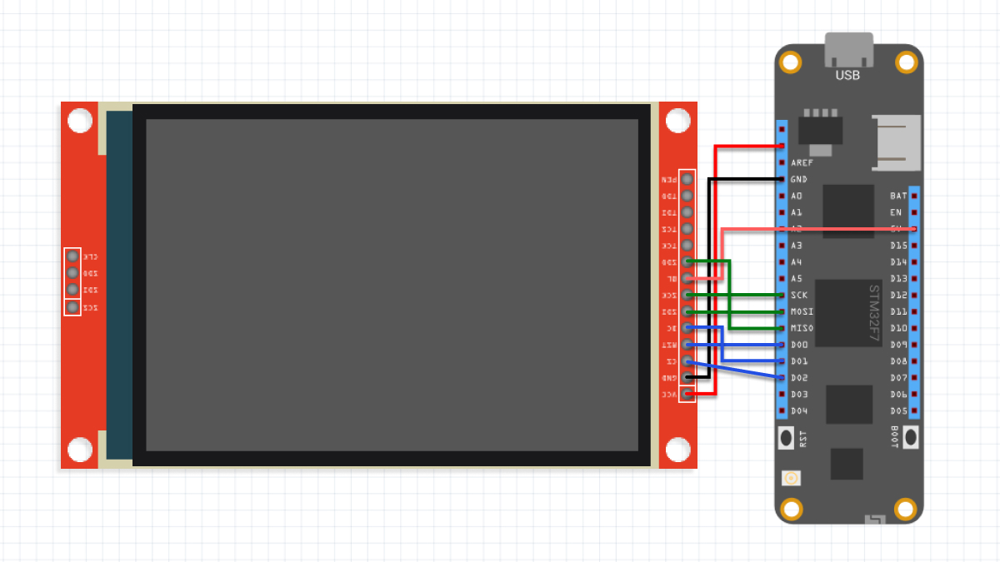

# NetFrames

NetFrames is a lightweight, connected display platform that allows digital picture frames or embedded screens to automatically fetch and display images from a central server. Designed for Raspberry Pi, Meadow, or mobile clients, NetFrames is ideal for personal photo galleries, public displays, or IoT art installations.

## Contents

* [Architecture](#architecture)
* [Build and Setup](#build-and-setup)
* [Support](#support)

## Architecture


### [NetFrames.Server](/Source/NetFrames.Server/)

NetFrames.Server is a .NET Core Web API, exposing endpoints to:
* Upload an image
* Get list of images
* Get specific image by ID.

### [NetFrames.WebPortal](/Source/NetFrames.WebPortal/)

The purpose of this portal is to manage the image collection that client devices will display on its screens.


### [NetFrames.EmbeddedClient](/Source/NetFrames.EmbeddedClient/)

You can build this digital portrait using a [Meadow F7 Feather](https://store.wildernesslabs.co/collections/frontpage/products/meadow-f7-feather) board and a ILI9341 TFT SPI 320x240 display.


#### Wiring

Wire the Meadow F7 Feather board with the ILI9341 like the diagram below:




#### Enclosure

Feel free to 3D print this enclosure so you can place it on a desk or mount it on a wall. STL files are [here](/Assets/Enclosure/) or download directly from [TinkerCad](https://www.tinkercad.com/things/222cHvoUr3W-netframes-case).


## Build and Setup

### Backend (Web API and Portal)

If you have a raspberry pi, install dotnet and run both the NetFrames.Server and NetFrames.WebPortal app:

#### NetFrames.Server

Go to the NetFrames.Server folder and run the command `dotnet run`:

```
jorgedevs@Jorge-:~/Projects/NetFrames/Source/NetFrames.Server$ dotnet run
Using launch settings from /home/jorgedevs/Projects/NetFrames/Source/NetFrames.Server/Properties/launchSettings.json...
Building...
info: Microsoft.Hosting.Lifetime[14]
      Now listening on: http://0.0.0.0:5000
info: Microsoft.Hosting.Lifetime[0]
      Application started. Press Ctrl+C to shut down.
info: Microsoft.Hosting.Lifetime[0]
      Hosting environment: Development
info: Microsoft.Hosting.Lifetime[0]
      Content root path: /home/jorgedevs/Projects/NetFrames/Source/NetFrames.Server
```

Clients such as the Meadow Digital Frame will send request to this web API. You'll need to jot down this server's IP address, and send request to the port 5000.

#### NetFrames.WebPortal

To get the Web portal up and grow your photo gallery, on your terminal go to the NetFrames.WebPortal project and run the command `dotnet run`:

```
jorgedevs@Jorge:~/Projects/NetFrames/Source/NetFrames.WebPortal$ dotnet run
Using launch settings from /home/jorgedevs/Projects/NetFrames/Source/NetFrames.WebPortal/Properties/launchSettings.json...
Building...
info: Microsoft.Hosting.Lifetime[14]
      Now listening on: http://0.0.0.0:5150
info: Microsoft.Hosting.Lifetime[0]
      Application started. Press Ctrl+C to shut down.
info: Microsoft.Hosting.Lifetime[0]
      Hosting environment: Development
info: Microsoft.Hosting.Lifetime[0]
      Content root path: /home/jorgedevs/Projects/NetFrames/Source/NetFrames.WebPortal
```

Now you can open a browser anywhere and enter the server's IP address with the port 5150 and the NetFrames web portal will show up.

#### NetFrames.EmbeddedClient

Finally, to set up your Meadow-powered Digital Frame, you'll only need to set your WIFI credentials in the `wifi.config.yaml` file, and set the base URL in the `RestClientController` class:

```
public class RestClientController
{
    // Base URL for the REST API (IP Address:Port)
    string baseUrl = "http://192.168.1.73:5150/";
...

```

## Roadmap

The following table show's whats available and what features are next in upcoming updates.

## Support

Finding bugs or wierd behaviors? File an [issue](https://github.com/jorgedevs/NetFrames/issues) with repro steps.
